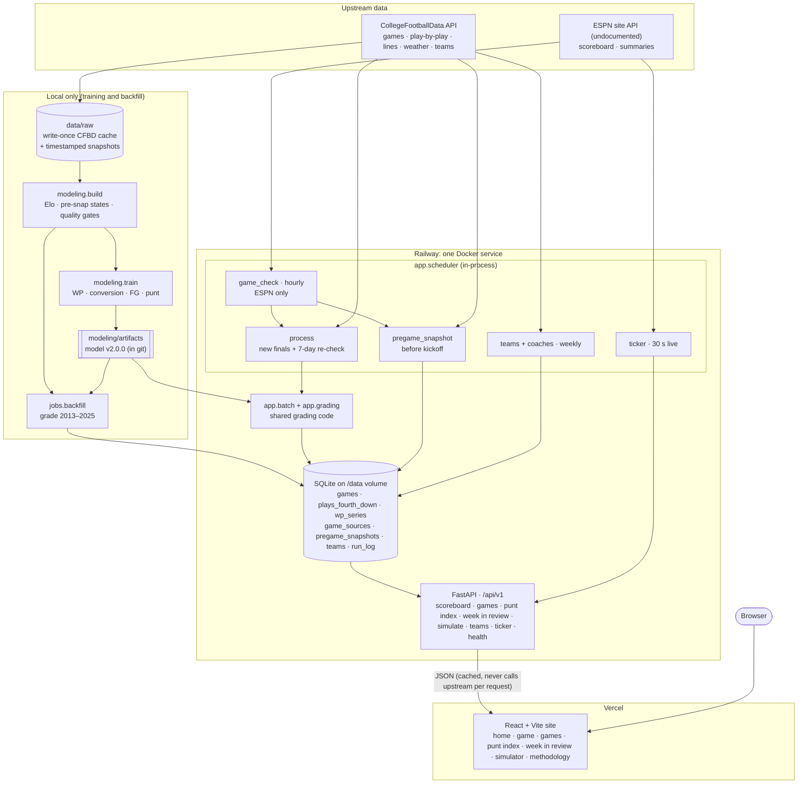

# cfb4thdown

College football fourth-down analytics. Every fourth down, every game, graded live against a win-probability model.

Rebuild of previous cfb4thdown.com website frontend and backend, replacing what's hosted there.

## Architecture



- **Local:** training and the historical backfill run on your machine from the raw CFBD cache. The resulting database is uploaded once to the Railway volume (`docs/deploy.md`).
- **Server:** the Railway service keeps the current season up to date by itself. Its jobs read Elo history and venues from the database, so the server never needs the raw cache.
- **Requests:** user requests only read SQLite. Upstream APIs are called by scheduled jobs, never per request.
- **Live grading** (pending fourth-down card) is Phase 6: `jobs.live_poll` exists but isn't scheduled yet.

## Layout

```
CLAUDE.md              project memory, loaded automatically by Claude Code
docs/                  specs — the source of truth
  sitemap.md           the six pages and what each is for
  design-spec.md       the night lights design system
  api-contract.md      endpoints and response shapes
  data-pipeline.md     raw plays to graded decisions
  automation.md        scheduled jobs
  deploy.md            Railway + Vercel setup
  roadmap.md           phases, status and exit criteria
.claude/
  agents/              subagents for architecture, frontend, pipeline, review
  commands/            slash commands
  settings.json        hooks
frontend/              React + Vite + Tailwind: design system, Methodology, dev previews
backend/               data pipeline, models, grading, jobs, FastAPI service
```

## Working with agents

Subagents are invoked by name or automatically based on their descriptions:

Slash commands:

| Command | Does |
|---|---|
| `/new-page live-scoreboard` | Scaffolds a page from the sitemap |
| `/design-check` | Audits the diff against the design spec |
| `/verify` | Typecheck, build, lint, test |

Hooks in `.claude/settings.json` format on save, block hex literals in components, and block writes to `data/raw/`.

## Setup

```bash
cp .env.example .env    # add CFBD_API_KEY
cd frontend && npm install
cd backend && uv sync
```

## Status

Phases 0–4 are built: models, grading, the 2013–2025 backfill, current-season processing, the API, scheduled jobs, and the home, game, games, Punt Index, Week in Review and simulator pages. The API runs on Railway and the site on Vercel (`docs/deploy.md`). See `docs/roadmap.md`.

## Run it locally

```bash
# API on :8000 (reads backend/data/cfb4thdown.db; add SCHEDULER_ENABLED=1 to run the jobs)
cd backend && uv run uvicorn app.api.main:app --reload --port 8000

# Site on :5173 (proxies /api to :8000)
cd frontend && npm run dev
```

The database isn't in git. Build it with `jobs.backfill` (see `docs/models.md` "Reproduce"), then `jobs.teams` and `jobs.process --season 2026` (`docs/automation.md`).

## Frontend

```bash
cd frontend
npm run dev          # http://localhost:5173
npm run typecheck && npm test && npm run lint:tokens && npm run build
```

Dev-only pages (never in production builds unless `VITE_DEV_ROUTES=true`):

- `/dev/components`: every shared component in each state, from obviously fake fixtures.
- `/dev/live`: the live scoreboard rendered from real captured ESPN polls, graded by the model. Pick a scene, step or play through consecutive polls, or force loading/error/stale/empty states.

## Live fixtures

Captured ESPN sessions are saved under `backend/fixtures/espn/<session>/` (raw polls, summaries, pregame snapshot rows) and exported as `GET /scoreboard/live` payloads to `frontend/src/dev/fixtures/live/<session>/`:

```bash
cd backend
uv run python -m jobs.live_capture --minutes 180            # during a slate
uv run python -m analysis.live_fixtures save --session 2026-09-19
uv run python -m analysis.live_fixtures export --session 2026-09-19
```

`export` needs the model artifacts. Both fixture directories are gitignored (data stays local); without them `/dev/live` falls back to fake values.
