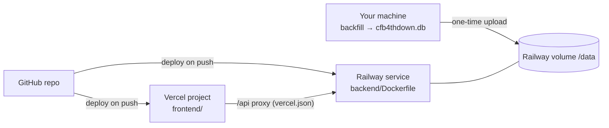

# Deploy

The API and its scheduled jobs run as a single Docker service on Railway, with SQLite on a Railway volume. The site is static on Vercel. The steps below go in order. Every command runs from the repo root unless it says otherwise.



---

## 0. Prerequisites

- **GitHub:** the repo pushed (`git push origin main`). Railway and Vercel both deploy from it.
- **Accounts:** [Railway](https://railway.com) (Hobby plan; volumes need a paid plan) and [Vercel](https://vercel.com) (Hobby is fine).
- **CLIs:**

  ```bash
  brew install railway
  npm i -g vercel        # optional; the dashboard works too
  railway login
  ```

- **Docker Desktop:** optional, to test the image locally in step 1.

## 1. Test the image locally (optional, recommended)

Start Docker Desktop, then:

```bash
docker build -t cfb4thdown-api backend
docker run --rm -p 8000:8000 \
  -v "$PWD/backend/data:/data" \
  -e SCHEDULER_ENABLED=0 \
  cfb4thdown-api
curl -s localhost:8000/api/v1/health
```

Keep `SCHEDULER_ENABLED=0` here so the container doesn't write to your local database.

## 2. Make a clean copy of the database

The database runs in SQLite's WAL mode, so copy it with `VACUUM INTO`. This produces one consistent file and is smaller than copying the live file.

```bash
cd backend
uv run python -m jobs.teams                     # fresh team metadata (1 CFBD call)
uv run python -m jobs.process --season 2026     # catch up the current season
sqlite3 data/cfb4thdown.db "VACUUM INTO 'data/deploy.db'"
gzip -k data/deploy.db                           # data/deploy.db.gz
ls -lh data/deploy.db data/deploy.db.gz
```

## 3. Create the Railway service

1. Railway dashboard → **New project** → **Deploy from GitHub repo** → pick `cfb4thdown-v2`.
2. Service **Settings**:
   - **Root directory:** `backend`. Railway finds `backend/Dockerfile`.
   - **Healthcheck path:** `/api/v1/health`.
   - **Networking:** **Generate domain**. Note it, e.g. `cfb4thdown-api.up.railway.app`.
3. Service → **Volumes** → **New volume**, mounted at `/data`. 1 GB is plenty for now.
4. Service → **Variables**:

   | Variable | Value |
   |---|---|
   | `CFBD_API_KEY` | your CFBD key |
   | `SCHEDULER_ENABLED` | `0` for now; you turn it on in step 5 |
   | `CFB4THDOWN_DB` | `/data/cfb4thdown.db` (already the image default) |
   | `CORS_ORIGINS` | leave empty until step 6 |

5. Keep the replica count at **1**. The scheduler and SQLite writes assume a single process.

The first deploy starts, but `/api/v1/*` returns `503 PIPELINE_COLD` until the database is on the volume. That's expected.

## 4. Upload the database to the volume

Railway has no file-upload button for volumes. Put the file somewhere the container can download it once, then delete it.

**Option A: private GitHub release asset.** Your repo stays private, so this uses a short-lived token.

```bash
gh release create db-seed-2026-09-13 backend/data/deploy.db.gz --repo lneuendorf/cfb4thdown-v2 \
  --title "DB seed (delete after deploy)" --notes "temporary" --prerelease
gh api repos/lneuendorf/cfb4thdown-v2/releases/tags/db-seed-2026-09-13 --jq '.assets[0].url'
# Prints https://api.github.com/repos/.../releases/assets/<id>
```

Open a shell in the running service and download it:

```bash
railway link            # pick the project and service
railway ssh
# inside the container (python:3.12-slim has no curl):
python - <<'PY'
import urllib.request
req = urllib.request.Request("<asset url from above>", headers={
    "Authorization": "Bearer <a GitHub token with Contents: read>",
    "Accept": "application/octet-stream"})
with urllib.request.urlopen(req) as r, open("/data/cfb4thdown.db.gz", "wb") as f:
    while chunk := r.read(1 << 20):
        f.write(chunk)
PY
gunzip -f /data/cfb4thdown.db.gz && ls -lh /data
exit
```

Keep `SCHEDULER_ENABLED=0` while copying. Then delete the release: `gh release delete db-seed-2026-09-13 --repo lneuendorf/cfb4thdown-v2 --yes --cleanup-tag`. Use a fine-grained token scoped to this repo and revoke it afterwards. Don't paste it anywhere else.

**Option B: any presigned URL.** For example S3, R2 or Dropbox. Upload `deploy.db.gz`, then download it inside `railway ssh` with the same Python snippet, without the Authorization header.

Check that it worked:

```bash
curl -s https://<railway-domain>/api/v1/health
curl -s "https://<railway-domain>/api/v1/scoreboard/latest?limit=1" | head -c 300
```

## 5. Turn on the scheduler

Set `SCHEDULER_ENABLED=1` in Railway variables. Railway redeploys; the volume and database persist. Within about a minute:

```bash
curl -s https://<railway-domain>/api/v1/health
# ticker_updated_at is set; last_runs.game_check.started_at updates within the hour (minute 5)
```

## 6. Create the Vercel project

The site calls `/api/...` on its own domain, and `frontend/vercel.json` forwards those requests to Railway. The browser only ever talks to one domain, so there's no CORS setup, and preview deployments work too.

1. Vercel dashboard → **Add new project** → import `cfb4thdown-v2`.
2. **Root directory:** `frontend`. The framework preset (Vite) and `frontend/vercel.json` handle the build, the API proxy and SPA rewrites.
3. **Environment variables:** none. Don't set `VITE_API_BASE`, and never add `CFBD_API_KEY` to Vercel.
4. **Deploy.** Production is `https://cfb4thdown-v2.vercel.app`.
5. Check `https://cfb4thdown-v2.vercel.app/api/v1/health`. It should return the API's JSON.

If the Railway domain changes, update the `destination` in `frontend/vercel.json`. `CORS_ORIGINS` on Railway can stay empty; it's only needed if you switch to calling the API directly with `VITE_API_BASE`.

## 7. Custom domains (optional)

- **Vercel:** Project → Domains → add `cfb4thdown.com` and follow the DNS instructions.
- **Railway:** Service → Networking → Custom domain → `api.cfb4thdown.com` (CNAME).
- **Then:** update the API `destination` in `frontend/vercel.json` if the API domain changed.

## 8. Monitoring

- **Uptime:** point a monitor (UptimeRobot, Better Stack) at `https://<api>/api/v1/health`.
- **Alerts:** alert when it's not 200, when `stale` is `true`, or when `last_runs.game_check.started_at` is more than 2 hours old in season.
- **Logs:** Railway → service → **Logs** shows scheduler output. `run_log` in the database has every job's counts and errors.
- **CFBD quota:** watch `cfbd_remaining` in `process` / `pregame_snapshot` run counts.

---

## Updating

- **Code:** push to `main`. Both platforms redeploy, and the volume keeps the database.
- **New model version:** re-run `jobs.backfill` locally, then repeat steps 2 and 4 with `SCHEDULER_ENABLED=0` during the copy. The server has no processed historical data to regrade from.
- **Rollback:** Railway → Deployments → redeploy an earlier build. Take a database backup first with `railway ssh` then `python -c "import sqlite3; sqlite3.connect('/data/cfb4thdown.db').execute(\"VACUUM INTO '/data/backup.db'\")"` (the image has no `sqlite3` CLI).

## Costs (rough)

- **Railway Hobby:** $5/month including usage credit. A 1 GB volume plus a small always-on container usually fits in about $5–10/month.
- **Vercel Hobby:** free for personal, non-commercial use. Commercial use needs Pro.
- **CFBD Tier 1:** your existing subscription. Expected use is 350–500 calls per in-season week (`docs/automation.md`).
